<Note>
**Beta**: Credential Monitoring is currently in beta. We're continuously expanding monitoring methods and adding new features to enhance your security posture.
</Note>


## What is Credential Monitoring?

Compromised credentials are one of the weakest security points and the easiest attack vector for cybercriminals. ProjectDiscovery's Credential Monitoring is a continuous threat intelligence system that detects compromised credentials from **malware stealer logs**, enabling security teams to prevent account takeovers. 

By continuously scanning millions of exposed credentials, the platform identifies actual credential exposures that pose immediate risk to your organization, employees, and customers. We specifically focus on malware stealer logs as these have proven to be the most impactful security vulnerabilities. As we evolve this beta product, we'll be expanding monitoring across GitHub repositories, crawled web pages, and other sources to detect exposed tokens, API keys, and environment secrets.
<Frame>
  
</Frame>

<Card
title="Try Credential Monitoring Now"
 icon="shield-check"
 color="green"
 href="https://cloud.projectdiscovery.io/leaks">

 <p>
  Start monitoring your credentials for free and see exposed credentials in
  real time.
 </p>
</Card>

## Feature access by plan

| Feature | Free Users | Free Business Domain Users | Enterprise Users |
| :------ | ---------- | -------------------------- | ---------------- |
| Personal email exposures | ✓ | ✓ | ✓ |
| Organization-wide credential exposures | ✗ | ✓ (Requires DNS verification) | ✓ |
| Export data (JSON/CSV) | ✓ | ✓ | ✓ |
| API access | ✓ | ✓ | ✓ |
| Multi-domain monitoring | ✗ | ✗ | ✓ |
| Priority support | ✗ | ✗ | ✓ |

## Domain Verification

<Info>
**Required for Organization-Wide Leaks**: To access **Employee Leaks** and **Customer/User Leaks** for your organization, you must first verify ownership of your domain.
</Info>

### How to Verify in the App

<Steps>
  <Step title="Navigate to Domains">
    Go to **Credential Monitoring → Domains → Add Domain**
  </Step>
  <Step title="Enter your domain">
    Type your domain name and click **Continue**
  </Step>
  <Step title="Choose verification method">
    Select your preferred method tab (DNS record / HTML meta tag / Upload TXT file) and follow the instructions. Use the built-in copy and download helpers.
  </Step>
  <Step title="Complete verification">
    After adding the record, meta tag, or file, click **Verify**. A successful verification marks the domain as **Verified** ✓
  </Step>
</Steps>

---

### Verification Methods

Choose from three verification methods based on your access level:

<CardGroup cols={3}>
  <Card title="DNS TXT Record" icon="server">
    Best when you have DNS access
  </Card>
  <Card title="HTML Meta Tag" icon="code">
    Best when you can edit your website
  </Card>
  <Card title="Upload TXT File" icon="file-arrow-up">
    Best when you can upload files to your site
  </Card>
</CardGroup>

<Tip>
The verification modal in the app provides **copy/download helpers** for each method to make setup quick and easy.
</Tip>

---

#### Method 1: DNS TXT Record

<Note>
**Recommended** — Standard method when you have access to edit DNS records for the domain.
</Note>

<Steps>
  <Step title="Create a TXT record">
    Add a TXT record on the root of your domain with the following value:

    ```
    projectdiscovery-verification=YOUR_VERIFICATION_STRING
    ```
  </Step>
  <Step title="Configure DNS settings">
    | Setting | Value |
    |---------|-------|
    | Host / Name | `@` (or "root" depending on your DNS provider) |
    | Type | `TXT` |
    | Value | `projectdiscovery-verification=YOUR_VERIFICATION_STRING` |
  </Step>
  <Step title="Verify in the app">
    Click **Verify** in Credential Monitoring. Once successful, your domain will show as **Verified**.
  </Step>
</Steps>

<Accordion title="Troubleshooting DNS Verification">
- **DNS propagation** can take up to 48 hours, though most verifications succeed within minutes
- Verify your record is live using terminal:

```bash
dig TXT yourdomain.com
```

Or for specific record names:

```bash
dig TXT _pd-verification.yourdomain.com
```
</Accordion>

---

#### Method 2: HTML Meta Tag

<Note>
Best when you can edit and deploy your site's HTML but cannot change DNS settings.
</Note>

<Steps>
  <Step title="Add the meta tag">
    Place this meta tag inside the `<head>` section of your root HTML page (`https://yourdomain/`):

    ```html
    <meta name="projectdiscovery-verification" content="YOUR_VERIFICATION_STRING" />
    ```
  </Step>
  <Step title="Deploy the change">
    Push the updated HTML to your live site.
  </Step>
  <Step title="Verify in the app">
    Click **Verify** in Credential Monitoring.
  </Step>
</Steps>

<Accordion title="Troubleshooting HTML Verification">
Confirm the tag is present in the deployed page:

```bash
curl -s https://yourdomain | grep projectdiscovery-verification
```

If verification fails:
- Ensure the change is on the **live site** (not staging)
- Clear any CDN/cache that might be serving an old version
</Accordion>

---

#### Method 3: Upload TXT File

<Note>
Best when you can upload static files to your site root but don't want to modify DNS or HTML.
</Note>

<Steps>
  <Step title="Create the verification file">
    Create a file named `pd-verification.txt` containing only your verification string:

    ```
    YOUR_VERIFICATION_STRING
    ```
  </Step>
  <Step title="Upload to your site root">
    Upload the file so it's accessible at `https://yourdomain/pd-verification.txt`
  </Step>
  <Step title="Verify in the app">
    Click **Verify** in Credential Monitoring.
  </Step>
</Steps>

<Accordion title="Troubleshooting File Verification">
Confirm the file is reachable and contains the expected string:

```bash
curl -s https://yourdomain/pd-verification.txt
```

If verification fails:
- Ensure the file is served over **HTTPS**
- Verify it's accessible at the exact root path
</Accordion>

---

### Quick Troubleshooting Reference

| Method | Command | Expected Result |
|--------|---------|-----------------|
| **DNS** | `dig TXT yourdomain.com` | Shows `projectdiscovery-verification=...` |
| **HTML** | `curl -s https://yourdomain \| grep projectdiscovery-verification` | Shows the meta tag in `<head>` |
| **File** | `curl -s https://yourdomain/pd-verification.txt` | Shows the verification string |

---

### FAQs About Verification

<AccordionGroup>
  <Accordion title="Do I need to verify to see personal leaks?">
    No — personal leaks are automatically visible for the email you used to sign up. Verification is only required for organization-wide views.
  </Accordion>
  <Accordion title="Can I verify multiple domains?">
    Only **Enterprise customers** can have multiple domains verified. You can self-verify each domain individually or reach out to support for bulk verification.
  </Accordion>
  <Accordion title="How long does verification take?">
    Usually 5–10 minutes, depending on DNS propagation time.
  </Accordion>
  <Accordion title="Do I need to reverify later?">
    No, once a domain is verified it remains linked unless the verification record is removed.
  </Accordion>
</AccordionGroup>

## How It Works

Our credential monitoring system:

1. **Collects** malware-stolen credential data from publicly accessible sources including:
   - Telegram channels and groups where malware logs are shared
   - Leaks forums and websites
   - Public repositories where malware logs are posted

2. **Processes** and filters the data to:
   - Parse credential pairs (email:password combinations) from malware logs
   - Extract domain and email information
   - Filter for credentials matching your monitored domains
   - Remove invalid formatted data

3. **Alerts** your team when credentials matching your monitored domains are found

<Warning>
All credential data comes from **publicly accessible sources** on the internet where malware logs are shared. We do not perform any unauthorized access or hacking to obtain this information.
</Warning>

<Note>
**Important**: ProjectDiscovery does not validate, test, or attempt to login with any collected credential information. We only collect and filter the data for formatting validity - we do not verify if credentials are active or functional.
</Note>

## Leak Classification and Mapping

ProjectDiscovery's Credential Monitoring categorizes discovered credentials into three distinct types based on their relationship to your organization. Understanding these categories helps prioritize remediation efforts and assess security impact across different stakeholder groups.

<Frame>
  
</Frame>

### Visual Data Flow

The following diagram illustrates how credential data flows through our classification system:

```mermaid
flowchart TD
    A["🔍 Malware Log Data<br/>Collection"] --> B["📊 Data Processing<br/>& Filtering"]
    
    B --> C{{"🏷️ Leak Classification<br/>Engine"}}
    
    C --> D["👤 My Leaks<br/><br/>• Credentials associated with<br/>your logged-in email<br/>• Personal account exposures<br/>• Direct user impact"]
    
    C --> E["👥 Employee Leaks<br/><br/>• Login emails containing<br/>Hooli domain<br/>• Company email addresses<br/>• Internal & external services<br/>• Workforce security impact"]
    
    C --> F["🏢 Customer/User Leaks<br/><br/>• Login URLs containing<br/>Hooli domain<br/>• External email addresses<br/>• Customer account exposures<br/>• External customer impact<br/><br/>⚠️ Excludes employee emails"]
    
    D --> G["📧 Email Notifications<br/>Immediate alerts"]
    E --> H["🚨 Security Dashboard<br/>Organization view"]
    F --> I["📊 Customer Risk<br/>Assessment"]
    
    style D fill:#e1f5fe,stroke:#333,stroke-width:2px,color:#000
    style E fill:#f3e5f5,stroke:#333,stroke-width:2px,color:#000
    style F fill:#fff3e0,stroke:#333,stroke-width:2px,color:#000
    style C fill:#f1f8e9,stroke:#333,stroke-width:2px,color:#000
    style A fill:#ffffff,stroke:#333,stroke-width:2px,color:#000
    style B fill:#ffffff,stroke:#333,stroke-width:2px,color:#000
    style G fill:#e8f5e8,stroke:#333,stroke-width:2px,color:#000
    style H fill:#ffeaa7,stroke:#333,stroke-width:2px,color:#000
    style I fill:#fab1a0,stroke:#333,stroke-width:2px,color:#000
    
    linkStyle default stroke:#333,stroke-width:2px
    linkStyle 0 stroke:#333,stroke-width:2px
    linkStyle 1 stroke:#333,stroke-width:2px
    linkStyle 2 stroke:#333,stroke-width:2px
    linkStyle 3 stroke:#333,stroke-width:2px
    linkStyle 4 stroke:#333,stroke-width:2px
    linkStyle 5 stroke:#333,stroke-width:2px
    linkStyle 6 stroke:#333,stroke-width:2px
    linkStyle 7 stroke:#333,stroke-width:2px
```



### Leak Categories Explained

#### 👤 My Leaks
**Personal Account Exposures**
- **Definition**: All credential exposures directly associated with your logged-in email address in the ProjectDiscovery platform
- **Scope**: Personal accounts and services where you used your email for registration
- **Impact**: Direct personal security risk requiring immediate attention
- **Example**: If you're logged in as `admin@hooli.com`, this shows all malware logs containing `admin@hooli.com` credentials
- **Access**: Available to all user tiers without additional verification

#### 👥 Employee Leaks  
**Organizational Workforce Exposures**
- **Definition**: All credential exposures where the **login email** contains your organization's domain, regardless of the service/platform where it was used
- **Scope**: Current and former employees using company email addresses on ANY platform or service
- **Impact**: Internal security risk affecting both organizational assets and external vendor access
- **Examples**:
  - **Internal Company Services**:
    - `john.doe@hooli.com` → `mail.hooli.com` (company email)
    - `sarah.smith@hooli.com` → `intranet.hooli.com` (internal systems)
  - **External/3rd Party Services**:
    - `john.doe@hooli.com` → `github.com` (code repositories)
    - `sarah.smith@hooli.com` → `aws.amazon.com` (cloud services)
    - `support@hooli.com` → `slack.com` (communication tools)
    - `admin@hooli.com` → `dropbox.com` (file sharing)
- **Access**: Requires domain verification for Business Domain Users; automatically available for Enterprise users
- **Privacy**: Only visible to Owner and Admin account types

#### 🏢 Customer/User Leaks
**External Customer Exposures** 
- **Definition**: All credential exposures where the **login URL/domain** contains your company domain, but the email address does NOT belong to employees
- **Scope**: Your customers and users who have accounts on your services or platforms
- **Impact**: External customer security risk affecting user trust and platform security
- **Examples**:
  - `user123@gmail.com` with login URL containing `hooli.com`
  - `customer@yahoo.com` accessing services at `app.hooli.com`
  - `buyer@outlook.com` with stored passwords for `shop.hooli.com`
- **Exclusions**: Does not include employee emails (those are classified as Employee Leaks)
- **Access**: Available to verified Business Domain Users and Enterprise customers

### Key Classification Distinction

<Info>
**Critical Understanding**: The fundamental difference between Employee and Customer leaks:

- **👥 Employee Leaks**: Determined by the **EMAIL ADDRESS** - any leak where the email contains your company domain, regardless of what service it was used on
  - `john@hooli.com` used on GitHub ✓ Employee Leak
  - `sarah@hooli.com` used on AWS ✓ Employee Leak  
  - `admin@hooli.com` used on Dropbox ✓ Employee Leak

- **🏢 Customer Leaks**: Determined by the **SERVICE/LOGIN URL** - any leak where external emails were used on your company's services
  - `user@gmail.com` used on `app.hooli.com` ✓ Customer Leak
  - `customer@yahoo.com` used on `shop.hooli.com` ✓ Customer Leak
</Info>

### Priority Matrix for Remediation

| Leak Type | Priority | Actions Required | Notifications |
|-----------|----------|------------------|---------------|
| **My Leaks** | Critical | Immediate password reset, enable MFA | Real-time email alerts |
| **Employee Leaks** | High | Force password resets, audit 3rd party access, security training | Dashboard alerts + email |
| **Customer Leaks** | Medium-High | Customer notification, password reset prompts | Dashboard alerts + email |

<Tip>
**Pro Tip**: Use the leak classification to implement different response workflows. Personal and employee leaks require immediate internal action (including auditing 3rd party service access), while customer leaks may need customer communication and platform-level security enhancements.
</Tip>

### Data Accuracy and Classification Logic

Our classification system uses advanced pattern matching and domain analysis to ensure accurate categorization:

- **Email Domain Matching**: Sophisticated regex patterns identify company domains in email addresses
- **URL Domain Extraction**: Advanced parsing extracts target domains from login URLs and service endpoints
- **Duplicate Prevention**: Cross-category filtering ensures employee emails don't appear in customer leak categories
- **False Positive Reduction**: Multiple validation layers minimize misclassification

## Understanding Malware-Based Credential Theft

### How Malware Steals Credentials
Malware (information stealers) typically harvest credentials from:

- **Browser saved passwords** - Chrome, Firefox, Edge, Safari stored passwords
- **Application credentials** - Email clients, FTP clients, messaging apps
- **System credential stores** - Windows Credential Manager, macOS Keychain
- **Browser cookies and sessions** - Active login sessions
- **Cryptocurrency wallets** - Wallet files and recovery phrases
- **SSH/RDP credentials** - Stored connection credentials

### Malware Log Structure
When malware infects a system, it creates "logs" containing stolen data that may include:
- Victim's system information (OS, location, etc.)
- Stolen passwords organized by application/browser
- Cookies and session tokens
- Cryptocurrency wallet data
- Screenshots and system files

These logs are then shared or sold on underground platforms, which is where we collect them from publicly accessible sources.

## Why Some Findings Lack Detailed Metadata

<Info>
**Important**: Not all credential exposures include complete metadata such as specific malware names, infection dates, or victim details. This happens because:

- **Data Processing**: Threat actors often strip identifying information before sharing logs
- **Source Aggregation**: Logs may pass through multiple hands before becoming publicly available  
- **Privacy Protection**: Some sources anonymize victim information
- **Technical Limitations**: Malware logs don't always contain complete metadata
</Info>

### Common Metadata Available
When present, malware logs may include:
- **Collection date** - When the malware harvested the credentials
- **Geographic location** - Country/region of infected system
- **System information** - OS version, browser versions
- **Malware family** - Type of stealer malware used (when identifiable)

### When Metadata is Missing or "Blank"
If findings show blank or missing source information:
- **The credentials are still valid threats** - treat them seriously
- **Source anonymization** - Information may have been stripped for privacy
- **Multiple aggregation** - Logs may have passed through several sources
- **Technical parsing issues** - Some log formats don't parse completely

## What Actions Should You Take?

When malware-exposed credentials are identified for your domain:

### Recommended Actions
1. **Force password resets** for all affected email addresses
2. **Enable multi-factor authentication** (MFA) on all affected accounts
3. **Disable compromised accounts** temporarily and review recent activity
4. **Rotate associated API keys** and service account passwords
5. **Scan endpoints** for malware infections
6. **Deploy endpoint protection** and implement password managers
7. **Conduct security training** to prevent future credential theft

### Handling Cases with Missing Source Details
When leak sources are blank or incomplete:
- **Prioritize these equally** - assume they represent active threats
- **Focus on remediation** rather than source investigation
- **Monitor affected accounts closely** for suspicious activity
- **Treat as confirmed malware exposure** and follow full remediation steps

## API Integration

Access credential monitoring data programmatically:

- **Export Leaks**: `POST /v1/leaks/export` - Export all leaked credentials (personal, employee, customer) with filtering options
- **Leak Details**: `POST /v1/leaks/info` - Get detailed information for a specific leak
- **Update Status**: `POST /v1/leaks/status` - Mark leaks as fixed or reopen them
- **Domain Stats**: `GET /v1/leaks/stats/domain` - Get leak statistics for any domain (public endpoint, no auth required)
- **Email Stats**: `GET /v1/leaks/stats/email` - Get leak statistics for any email (public endpoint, no auth required)

For detailed API documentation and usage examples, see the [API Reference](/api-reference/leaks/export-leaks).

<Tip>
Integrate these API endpoints with your security tools to automatically trigger password resets and security reviews when new malware-based exposures are detected.
</Tip>

## Common User Questions

**Q: Can all team members see our organization's exposed credentials?**
A: No, credential visibility is restricted to Owner and Admin accounts only. This ensures sensitive breach data is only accessible to authorized personnel responsible for security.

**Q: Why can't I see employee passwords?**
A: Business Domain Users can view employee passwords data after DNS verification. Only Enterprise customers can monitor multiple domains.

**Q: How do I view my personal leaked credentials?**
A: You can automatically view all leaked credentials associated with the email address you used to sign up. Simply navigate to "My Leaks" to see any exposures linked to your personal email account - no additional verification required.

**Q: What breach notifications will I receive?**
A: All users receive email notifications when new breaches affecting their personal email are discovered. Business Domain Users (after DNS verification) and Enterprise customers also receive notifications for employee credential exposures across their organization.

**Q: How do I monitor my company's domain?**
A: Business domain users must verify their domain via DNS TXT record to access organization-wide breach data. Without verification, you'll only see personal email exposures. Enterprise users can verify and monitor multiple domains.

**Q: Are you monitoring our employees?**
A: No, we monitor internet-wide credential leaks and aggregate them into a comprehensive database. When you verify your domain, we filter this existing database to show only exposures related to your organization. We're not actively monitoring your employees - we're helping you discover credentials that are already publicly exposed across the internet.

**Q: How accurate is the breach data?**
A: We aggregate data from multiple verified sources. While false positives are possible, always verify before taking action.

**Q: How current is the data?**
A: We continuously monitor sources 24/7. New breaches typically appear within hours to days of being discovered.

**Q: How did these credentials get stolen?**
A: The credentials were harvested by malware (information stealers) that infected user devices. These malware strains steal saved passwords from browsers and applications, then upload the data to command-and-control servers where it eventually gets shared publicly.

**Q: Are these from phishing attacks or data breaches?**
A: No. Our credential monitoring specifically focuses on **malware-based credential theft only**. We do not track credentials from phishing campaigns or corporate data breaches.

**Q: Why don't all findings show malware names?**
A: Malware logs don't always contain identifying information about the specific malware strain. Additionally, logs are often processed and anonymized before being shared publicly, which strips technical details.

**Q: Why are some metadata fields showing as blank?**
A: This indicates that metadata fields (such as malware family name, collection date, geographic location, or system information) were not available in the original malware log or were stripped during processing. The credentials are still legitimate exposures that require immediate action.

**Q: Do you test if these credentials actually work?**
A: No. ProjectDiscovery does not validate, test, or attempt to login with any collected credential information. We only collect and present the data as found in publicly accessible malware logs.
